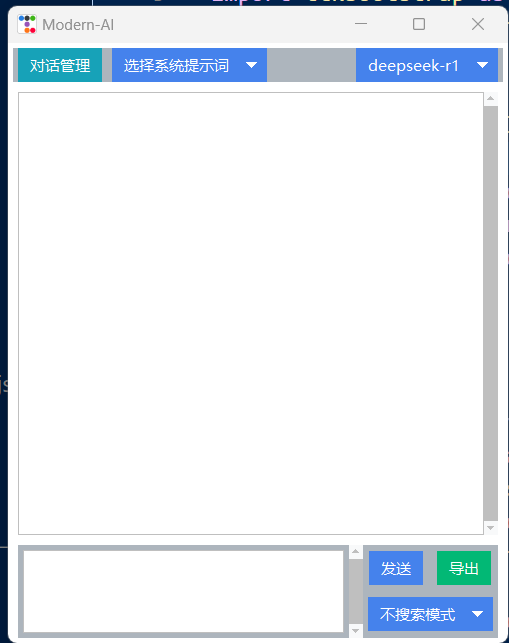

# Foreword
- Who it suits: Those who frequently review their own markdown notes (e.g., Obsidian) and those who need to quickly access local AI.
# Function Introduction
1. Basic conversation (multi-turn dialogue management)
2. Prompt word feature
    - System prompt words: Global prompts
    - Custom prompt words: Quickly call up custom prompts by @
3. Knowledge base search function
    - Search-only function: Displays the most relevant content from markdown notes based on their titles.
    - RAG functionality: Enables large models to combine searched content in their responses.
4. Shortcut key settings
    - alt + s: Show/hide window
    - alt + q: Copy text from clipboard to input box
5. Effect images

# First Use
1. Set up the environment, recommended using a conda virtual environment. Navigate to this project directory and execute pip install -r requirements.txt.
2. Configure your model, including llm and embedding. Llm only needs to be compatible with OpenAI's standard interface; embedding supports Ollama only. Configure prompt templates (optional), these configurations correspond to three JSON files respectively.
3. On first use, please run update_knowledge.py to update your knowledge base. Initially, it defaults to test_markdowns under this directory. You can temporarily leave it as is to test functionality. If you need to switch to your own path (containing markdown notes), continue reading below.
4. Then execute main.py. The first run will load all markdown titles (for indexing). If you don't want to load them every time, comment out vector_db.add_documents(docs) in search_module's get_vector_store() function at line 15.

# RAG
RAG consists of two parts: one requires adding your knowledge base path (in update_knowledge.py), and the other needs to load your knowledge base titles (from search_module's get_vector_store() function's vector_db.add_documents(docs)).
## Custom Knowledge Base Path
- Replace line 132 in update_knowledge.py where md_folder = "test_markdowns" with your own markdown root path.

## Update Your Title Index
1. Manually delete the chroma_db folder under this directory.
2. If you haven't commented out vector_db.add_documents(docs) in search_module's get_vector_store() function, running main.py will reload your title index.

# Other Notes
- This is my first small project, with zero experience, and most of it was completed with AI assistance. Please be kind and feel free to provide suggestions!
