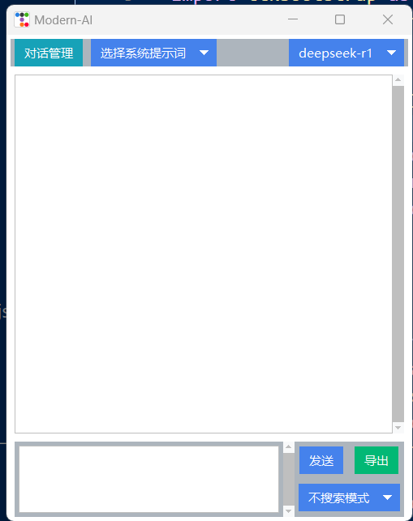

# 前言
- 适合谁：需要经常查看自己md笔记内容（如obsidian）和需要快速调用本地ai的人
# 功能介绍
1. 基本的对话（历史多轮对话管理）
2. 提示词功能
    - 系统提示词：全局的提示词
    - 自定义提示词：通过@快速唤出自定义的提示词
3. 知识库检索功能
    - 仅搜索功能：可以将搜索到的md笔记的最可能的标题里面的内容显示出来
    - RAG功能：可以让大模型结合搜索的内容回答
4. 快捷键设置
    - alt + s：显示/隐藏窗口
    - alt + q：将剪切板的文字复制到输入框
5. 效果图

# 第一次使用
1. 配置环境，建议使用conda虚拟环境 到该文件茛目路执行pip install -r requirements.txt
2. 配置你的模型，包括llm和embedding，llm只需兼容openai标准接口，embedding只支持ollama，配置提示词模板（可选），这些配置分别对应三个json文件
3. 第一次使用请先执行update_knowledge.py,将更新你的知识库，一开始默认为该目录下的test_markdowns，你暂时可以先不修改，测试能不能跑通，如果需要切换为你自己的路径（包含md笔记），请继续往下看
4. 然后再执行main.py即可，第一次会加载所有md的标题(用于索引)，如果不想每次都加载，注释search_module的get_vector_store()函数的vector_db.add_documents(docs) ，位于第15行

# RAG
RAG就由两部分组成，一个是需要添加你的知识库路径（update_knowledge.py），一个是你需要将知识库的标题加载出来（search_module的get_vector_store()函数的vector_db.add_documents(docs)，）
## 自定义知识库路径
- 替换update_knowledge.py的第132行md_folder = "test_markdowns" 为你自己的markdown根路径

## 更新你的标题索引
1. 需要手动删除该目录下的chroma_db文件夹
2. 如果没有注释search_module的get_vector_store()函数的vector_db.add_documents(docs)，直接执行main即可，会重新加载你的标题索引

# 其它
- 本人第一次做这种小项目，完全零经验，大部分借助AI完成的，还请大家多多包容，欢迎大家提建议！
